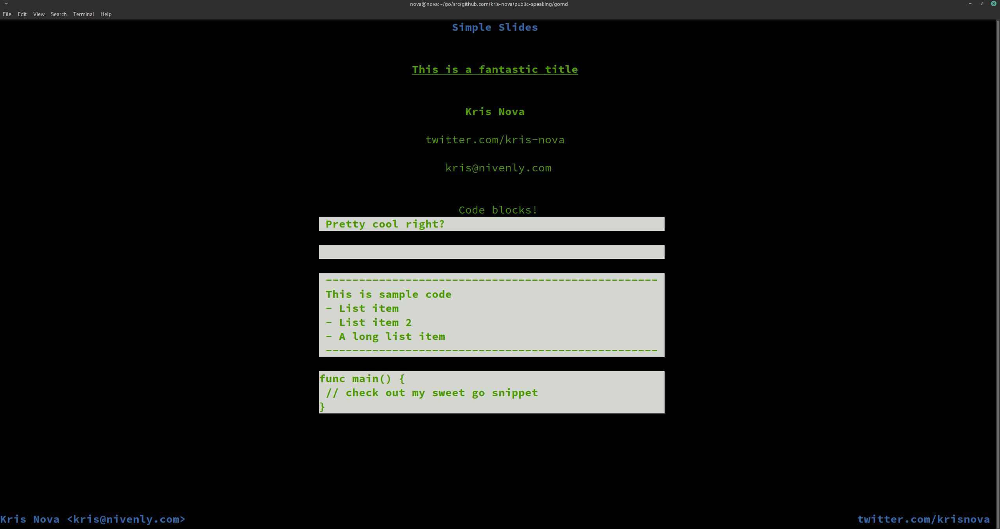

# zomg

<p align="center"></p>
<p align="center"><b>A simple solution to presenting from the command line.</b></p>

zomg is a a small binary that parses an extremely simple markdown syntax to help you build really sweet presentations.

It runs on the command line.

zomg will work with any remote control slide device as the only input for zomg is any input from a keyboard.

Press any key to advance one slide. Exit zomg by pressing keys until your slides are done.

## .zomg files

With `zomg` you create a directory of `.zomg` files. These are parsed alphabetically so if you want to control the order of your slides you should label them like this:

```bash
1-slide.zomg
1.1-slide.zomg
1.2-slide.zomg
2-slide.zomg
4-slide.zomg
LICENSE
README.md
WHATEVER.txt
```

Run the presentation by pointing `zomg` to the directory that contains your `.zomg` files

```bash
zomg ~/presentations/my-keynote/
```

## .zomg syntax

`#` Title

`##` Heading 1

`###` Heading 2

`####` Heading 3 / Paragraph 

`//` Code block aligned in sections 

`/!` New line in the slide 

`Comments have no syntax` Just type wherever you like
 
## Example .zomg file

```markdown

------------------------------------------------------------------------------------------------------------------------
Feel free to type comments however you please in your slides. These are handy for speaker notes or just general context.

You can include as much whitespace as you want. It will all be ignored.

Create a title like this:
# This is a fantastic title

Create empty lines in your slide like this
/!
/! You can even comment here and it will be ignored


This is a subheading (2)
## Kris Nova
/! Remember this is a newline in the slide

This is a subheading (3)
### twitter.com/kris-nova

Another newline in the slide
/!

Another subheading (3)
### kris@nivenly.com
/! yup, a newline
/! newline


This is where things get interesting
### Code blocks!

// Pretty cool right?
/!

You can even use spaces to make it bigger

//
/!                                                   ^ The spaces stop there(ish)

Jazz it up with some slick dashes for ultra hacker mode
// ---------------------------------------------------
// This is sample code
// - List item
// - List item 2
// - A long list item
// ---------------------------------------------------
/!

//func main() {
// // check out my sweet go snippet
//}
```

### README.md

You can define a `README.md` file for each of your presentations so that you can add notes and context for them. 

There are however, special rules about `README.md` files. For example:

```
# Simple Slides

The first `#` line in the `README.md` becomes the title of the presentation (upper center)

## Kris Nova <kris@nivenly.com>

The first `##` line in the `README.md` becomes the author of the presentation (lower left)

## twitter.com/krisnova

The second `##` line in the `README.md` becomes the meta tag of the presentation (lower right)

### Other notes

You can include other headings, and any other readme text you would like. All of which will be ignored by zomg

```

## Installing zomg

```
git clone https://github.com/kris-nova/public-speaking
cd public-speaking/zomg 
go build -o zomg .
chmod +x zomg
mv zomg /usr/local/bin/zomg
``` 

## Themes

Feel free to open a PR and add a theme. Here are some examples of themes to give you an idea of how simple they are to build.

**Note**: There is also a map in `root.go` that you will need to update if you PR a new theme
**Note**: We use `termbox` for the TTY control. Read more [here](https://github.com/nsf/termbox-go)

#### basic

```go
package mdterm

import "github.com/nsf/termbox-go"

const BasicTheme ThemeName = "basic"

type ThemeBasic struct {
}

func (t *ThemeBasic) AttrsByElement(e Element) (termbox.Attribute, termbox.Attribute) {
    // all the things
	return termbox.ColorDefault, termbox.ColorDefault
}
```

#### nova

```go
package mdterm

import "github.com/nsf/termbox-go"

const NovaTheme ThemeName = "nova"

type ThemeNova struct {
}

func (t *ThemeNova) AttrsByElement(e Element) (termbox.Attribute, termbox.Attribute) {
	switch e.Label() {
    // Title
	case t1:
		return termbox.ColorGreen | termbox.AttrBold | termbox.AttrUnderline, termbox.ColorDefault
    // Heading 1
	case t2:
		return termbox.ColorGreen | termbox.AttrBold, termbox.ColorDefault
    // Heading 2
	case t3:
		return termbox.ColorGreen, termbox.ColorDefault
    // Code blocks
	case nl:
		return termbox.ColorGreen | termbox.AttrBold, termbox.ColorWhite
    // Left author, right meta, tittle
	case ll, tt, rr:
		return termbox.ColorBlue | termbox.AttrBold, termbox.ColorDefault
    // Everything else
	default:
		return termbox.ColorDefault, termbox.ColorDefault
	}
}
```
